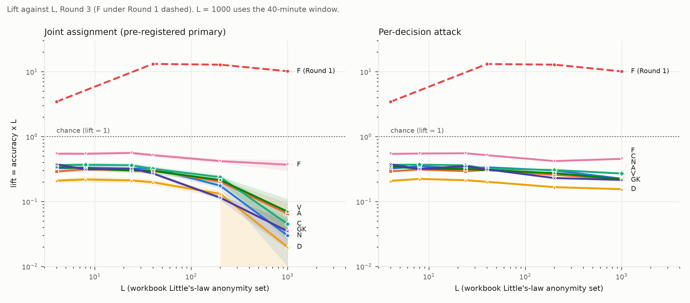

# Insider-compromise results

The [extension](#extension-every-role-the-null-case-adversary-confidence-and-scale) at the end adds
the null case, roles A, D, V and a gatekeeper, adversary confidence, and scale to L = 1000.

## Configurations

**Adopted configuration: redesign + gatekeeper hold.** The adopted GPA settings (node-wide relay
clock, per-channel device phase, F/I hold on each server's own clock, no CV-1/2 hold, 25
background clients per node), with the Insider Experiment Design changes and the gatekeeper
posting hold:
- the corrected role rules (B3);
- one active set of three gatekeepers per run, never C, F or I (B4);
- C fans out to all three gatekeepers, with a 2-of-3 quorum (B5);
- the ring signature on C's signature (B6);
- each gatekeeper holds C's GK leg in the lottery (10-second ticks, 8.33% release per tick,
  5-minute cap) before countersigning and posting to its match board. Each gatekeeper runs its
  own dedicated hold clock, with its phase drawn once and independently of its relay clock, the
  other gatekeepers' hold clocks, C's fan-out clock and the F/I hold clocks.

**Comparison configurations**, on the same paired seeds:
- **Redesign without the hold:** B3 to B6.
- **Exclusion only:** B3 to B5, with C's plain signature.
- **Fresh-phase check:** the adopted configuration, with a fresh hold phase drawn for every held
  post in place of a dedicated clock per gatekeeper.

Scenarios F, I and C ran at 80, 240 and 400 devices with a 20-minute interval (L = 8, 24, 40),
200 runs per scenario, device count and configuration: 7,200 runs in all.

**Original design.** The first insider run tested the design before the Insider Experiment
Design changes (workbook *Insider Results*; numbers in `results/first_run/`). Its results appear
as a further comparison column at the same L. Methods are in [`README.md`](README.md).

## Headline

**The gatekeeper hold narrows the GK-leg timing search and leaves a residual, so the pathway
stays open.** Under the redesign without the hold, the search is what keeps a compromised F or I
above 1/L. With the hold added:
- **The insider falls below 1/L everywhere.** Every accuracy interval, in every scenario and
  variant at every L, lies below 1/L. The full variant reaches 6.3–6.6% at L = 8 (1/L = 12.5%),
  1.9% at L = 24 (1/L = 4.2%) and 1.2–1.4% at L = 40 (1/L = 2.5%).
- **Combining the search with timing gains nothing measurable.** On paired runs (F and I pooled),
  full minus timing-only is +0.3, −0.1 and 0.0 points at L = 8, 24, 40, and every 95% interval
  contains zero. Under the redesign without the hold, the full variant was 3.0–3.2× timing-only
  at L = 8 and 24.
- **On its own, the search still carries information.** Scored alone (the legs variant: GK legs
  and quorum agreement, no content-arrival timing), it finds the true pairing 2.7–2.9× as often
  as random assignment over the same candidates: 5.1% against 1.8% at L = 8, 1.5% against 0.6%
  at L = 24, 1.0% against 0.4% at L = 40 (F and I pooled). It stays below 1/L and at or below
  timing-only. Since combining it with timing gains nothing, it adds no measurable information to
  timing alone.
- **Calibration collapses.** Top-decile accuracy is 9–13% at L = 8, with intervals that include
  1/L, and about 2% at L = 40. Items with a score gap of 2 nats or more fall from 400–800 per
  scenario to 0–14.

The hold also lowers the timing-only variant (paired, F and I pooled: 1.6, 0.4 and 0.4 points
lower at L = 8, 24, 40, all intervals excluding zero) and a compromised C's attack (8.5% to 4.5%
at L = 8). Both attacks depend on the gap between C's send and the quorum, and the hold adds
independent jitter to that gap.

The outside observer's sequencing attack is essentially unchanged by the hold (4.3%, 1.3% and
0.8% at L = 8, 24, 40) and stays below 1/L.

The dedicated per-gatekeeper clock and the fresh-phase check give the same results: every paired
difference has a 95% interval containing zero.

## The pathway the hold targets: the redesign without the hold

**The redesign without the hold leaves the pairing open.** A compromised F or I links its
content to the credential transaction above 1/L at every tested L:
- 24–25% at L = 8 (1/L = 12.5%);
- 7.3–7.5% at L = 24 (1/L = 4.2%);
- 3.1–3.2% at L = 40 (1/L = 2.5%).

Every 95% interval lies above 1/L. The predictions are partly calibrated. At L = 8, the top 10% of
score gaps is 60% correct against 24% overall, and over 400 predictions per scenario carry a gap
of 2 nats or more.

The remaining signal comes from the GK legs on the wire. Every C sends its three GK legs to
the same three active gatekeepers, and each leg carries C as its sender. A compromised F knows
its own quorum-detection tick exactly. It can search every sender for a set of GK legs whose
implied quorum falls inside its detection window, and that recovers C from timing alone, with no
use of the signature. Scored on its own, the search reaches 22% at L = 8, 6.1–6.2% at L = 24 and
2.5–2.6% at L = 40, close to the full variant. The positive control (lottery off) confirms the
search: it pins over 90% of pairings with the ring signature in place.

**Without the hold, timing alone stays below 1/L in every scenario, and a compromised C stays
below 1/L on every point estimate.** At L = 24, C's interval [3.2–4.4] reaches 1/L (4.2%).

### Against the stated predictions

The stated predictions held for the identity pathway and missed for the result as a whole:
- **The ring signature removes the identity disclosure.** Guessing among the remaining
  candidates falls from 28–29% (exclusion only) to 1.3–1.9% at L = 8, well below 1/L.
- **The full variant stays above the timing-only floor.** It is 3.0–3.2× timing-only at L = 8
  and 24, and 1.8–1.9× at L = 40.

| Prediction (Insider Experiment Design!B9) | Measured |
|---|---|
| The gatekeeper exclusion removes the gatekeeper-overlap contribution. | The exclusion-only full variant sits 12–17 points below the original design's no-overlap items at the same L (for example 60% vs 74% at L = 8). That is more than the overlap itself contributed on average (a 6–17 point gain on the 14–17% of items that had an overlap). The same step also fixes one active gatekeeper set for every transaction, so the posting gatekeepers' identities no longer narrow the GK-leg search, and it applies the corrected role rules. The exclusion-only configuration changes all three at once, so their separate contributions remain unmeasured. |
| The ring signature removes the identity-disclosure contribution. | Confirmed. Guessing among candidates falls from 28–29% to 1.3–1.9% at L = 8, and from 5.4–5.6% to 0.3–0.4% at L = 40. |
| Together, the full variant collapses toward the timing-only floor, under 1/L. | Not met. The redesign's full variant is 1.25–2.0× 1/L and 1.8–3.2× timing-only, through the GK-leg timing search. |

## F and I compromised

### Adopted configuration

Columns:
- **Hold: full:** the headline figure, with its random-assignment baseline.
- **Hold: legs:** the GK-leg search alone (legs and quorum agreement, no content-arrival timing).
- **Redesign:** the redesign without the hold, same variants, on the same seeds.
- **Fresh-phase check:** the full variant with a fresh hold phase per post.

| Role | Devices | L | 1/L | **Hold: full** | Hold full: random assignment | Hold full: top-decile accuracy | Hold full: gap ≥ 2 nats | Hold: legs | Hold legs: random assignment | Hold: timing only | Redesign: full | Redesign: legs | Redesign: timing only | Fresh-phase check: full |
|---|---|---|---|---|---|---|---|---|---|---|---|---|---|---|
| F | 80 | 8 | 12.5% | **6.3% [5.1–7.6]** | 1.7% | 13.0% | 14 of 1,610 | 4.9% [3.9–6.0] | 1.8% | 7.1% [6.0–8.3] | 24.2% | 22.0% | 7.6% | 6.6% [5.6–7.8] |
| F | 240 | 24 | 4.2% | **1.9% [1.6–2.3]** | 0.6% | 3.7% | 3 of 4,877 | 1.6% [1.3–2.0] | 0.5% | 2.1% [1.7–2.5] | 7.5% | 6.1% | 2.4% | 2.3% [1.8–2.7] |
| F | 400 | 40 | 2.5% | **1.2% [1.0–1.5]** | 0.4% | 1.8% | 0 of 7,930 | 1.0% [0.8–1.2] | 0.3% | 1.4% [1.1–1.7] | 3.1% | 2.6% | 1.7% | 1.3% [1.1–1.6] |
| I | 80 | 8 | 12.5% | **6.6% [5.4–7.7]** | 1.8% | 9.4% | 11 of 1,597 | 5.3% [4.2–6.4] | 1.8% | 5.3% [4.1–6.5] | 25.0% | 22.4% | 7.9% | 6.1% [4.9–7.4] |
| I | 240 | 24 | 4.2% | **1.9% [1.6–2.3]** | 0.4% | 3.4% | 3 of 4,754 | 1.5% [1.1–1.8] | 0.6% | 2.0% [1.6–2.4] | 7.3% | 6.2% | 2.5% | 2.3% [1.9–2.7] |
| I | 400 | 40 | 2.5% | **1.4% [1.1–1.6]** | 0.3% | 1.9% | 0 of 8,062 | 1.1% [0.9–1.3] | 0.5% | 1.3% [1.0–1.5] | 3.2% | 2.5% | 1.7% | 1.4% [1.2–1.7] |

### Comparison configurations

Columns:
- **Redesign: full,** with its random-assignment baseline (guessing among candidates).
- **Exclusion only:** the full variant without the ring signature, with its own random baseline.
- **Original design:** the full variant at the same L, overall and for items with no
  gatekeeper overlap.

| Role | Devices | L | 1/L | Redesign: full | Redesign: guessing among candidates | Redesign full: top-decile accuracy | Redesign full: gap ≥ 2 nats | Exclusion only: full | Exclusion only: guessing | Timing only | Original design: full | Original design: full, no overlap |
|---|---|---|---|---|---|---|---|---|---|---|---|---|
| F | 80 | 8 | 12.5% | 24.2% [22.1–26.3] | 1.9% | 59.6% | 435 of 1,610 | 60.2% [57.6–62.6] | 28.3% | 7.6% [6.3–8.9] | 75.4% | 74.3% |
| F | 240 | 24 | 4.2% | 7.5% [6.8–8.3] | 0.7% | 17.6% | 810 of 4,877 | 30.1% [28.9–31.3] | 10.5% | 2.4% [2.0–2.9] | 47.9% | 45.9% |
| F | 400 | 40 | 2.5% | 3.1% [2.7–3.5] | 0.4% | 6.8% | 748 of 7,930 | 18.0% [17.1–18.9] | 5.4% | 1.7% [1.5–2.0] | 32.6% | 30.3% |
| I | 80 | 8 | 12.5% | 25.0% [22.8–27.2] | 1.3% | 59.4% | 443 of 1,597 | 60.0% [57.6–62.3] | 29.1% | 7.9% [6.6–9.2] | 76.5% | 74.5% |
| I | 240 | 24 | 4.2% | 7.3% [6.6–8.0] | 0.6% | 17.6% | 785 of 4,754 | 28.3% [27.2–29.5] | 9.5% | 2.5% [2.0–2.9] | 47.6% | 45.5% |
| I | 400 | 40 | 2.5% | 3.2% [2.8–3.7] | 0.3% | 7.1% | 808 of 8,062 | 18.4% [17.5–19.3] | 5.6% | 1.7% [1.4–2.0] | 33.2% | 30.7% |

Timing-only results are identical under exclusion only and the redesign: the variant uses no
identity, and the runs are paired.

## C compromised

| Devices | L | 1/L | **Hold** | Hold: random assignment | Hold: top-decile accuracy | Fresh-phase check | Redesign | Redesign: random assignment | Redesign: top-decile accuracy | Original design, same L | GPA sequencing, same L |
|---|---|---|---|---|---|---|---|---|---|---|---|
| 80 | 8 | 12.5% | **4.5% [3.5–5.6]** | 1.2% | 4.4% | 4.7% [3.8–5.8] | 8.5% [6.9–10.0] | 1.1% | 8.9% | 9.2% | 4.2% |
| 240 | 24 | 4.2% | **1.3% [1.0–1.6]** | 0.4% | 1.1% | 1.4% [1.1–1.7] | 3.8% [3.2–4.4] | 0.5% | 3.8% | 2.7% | 1.5% |
| 400 | 40 | 2.5% | **0.8% [0.6–1.0]** | 0.2% | 0.8% | 0.9% [0.7–1.1] | 1.8% [1.6–2.2] | 0.3% | 1.8% | 1.6% | 0.8% |

No prediction in any C configuration carries a score gap of 2 nats or more. C's attack uses only
its own GK legs and the registry gossip, so the ring signature does not affect it, and the
exclusion-only results match the redesign within noise. The gatekeeper hold lowers it at every L
(paired differences of 4.0, 2.5 and 1.0 points, all intervals excluding zero), because the quorum
C computes from its own GK legs no longer fixes when the gatekeepers post.

## The outside observer

The ring-signed GK leg travels in its own size class (842–882 B on the wire). The GPA sequencing
attack, on 200 runs per point:

| Devices | L | GPA sequencing, redesign + gatekeeper hold | GPA sequencing, redesign | GPA sequencing, published |
|---|---|---|---|---|
| 80 | 8 | 4.3% [4.1–4.5] | 4.3% [4.1–4.5] | 4.2% |
| 240 | 24 | 1.3% [1.2–1.4] | 1.4% [1.3–1.5] | 1.5% |
| 400 | 40 | 0.8% [0.7–0.8] | 0.8% [0.8–0.9] | 0.8% |

The size class gives the observer with no keys nothing measurable. The gatekeeper hold leaves
the observer's sequencing attack almost where it was: 4.29% with and without the hold at L = 8,
1.39% to 1.30% at L = 24, and 0.82% to 0.77% at L = 40. With and without the hold, the attack
stays below 1/L and above random assignment (1.2%, 0.3% and 0.2% at L = 8, 24, 40), matching the
published GPA results.

## Gatekeeper hold clocks: independence

`python -m insider.clock_check` measures the hold clocks directly on 150 runs at 400 devices
(`results/clock_check.json`). Each phase comparison uses one pair per run, so the samples in each
test are independent. A uniform phase difference across runs means the two clocks are unrelated.

| Check (dedicated per-gatekeeper clock) | Result |
|---|---|
| Posts on their own gatekeeper's hold-clock grid (within gatekeeper processing time) | 100.0% of posts |
| Hold phase against the same gatekeeper's relay clock | uniform, KS p = 0.14 |
| Hold phase between two gatekeepers of the active set | uniform, KS p = 0.53 |
| Hold phase against C's fan-out clock | uniform, KS p = 0.69 |
| Hold phase against F's or I's clock | uniform, KS p = 0.27 |
| Hold lengths of the three gatekeepers within a submission (Spearman p-values over 450 pairs) | uniform, KS p = 0.82 |
| Mean hold | 106 s |

In the fresh-phase check, each gatekeeper's post phases spread uniformly, with no shared grid
(KS p = 0.12 on the per-gatekeeper p-values). Hold lengths within a submission are again
uncorrelated (KS p = 0.14), and the mean hold is 106 s.

## Gatekeeper hold: isolating control

`python -m insider.control` switches every other lottery hold off (relay hops, C fan-out, F/I
hold) and keeps the ring signature, so the two arms differ only in the gatekeeper hold. It runs F
compromised at 40 devices (L = 4), 10 runs, with every node taking a turn as X (807 items per
arm; `results/control.json`).

| Variant | No hold: accuracy | No hold: random assignment | Hold only: accuracy | Hold only: random assignment |
|---|---|---|---|---|
| legs | 78.2% | 79.9% | 20.1% | 8.7% |
| timing | 93.9% | 96.2% | 96.5% | 95.8% |
| full | 96.5% | 79.6% | 97.5% | 9.9% |

The legs row is the isolating comparison. With the lottery off, content-arrival timing alone pins
almost every pairing whether or not the gatekeepers hold, so the timing and full variants stay at
94–98% in both arms and cannot show the hold's effect. The legs variant scores only the GK-leg
search and its quorum agreement.

Without the hold, the search's detection window leaves about one candidate per item: random
assignment is already 79.9%, and the search reaches 78.2%. Adding only the gatekeeper hold forces
the window to cover the hold. Random assignment over that wider window falls to 8.7%, and the
search reaches 20.1%, about 2.3× random. The hold on its own removes most of the pathway and
leaves a residual above random, the same pattern as in the full sweep.

## Device count and L

Every attack here scores pairings of submissions, and its inputs depend on the submission rate
(devices ÷ interval), which is what L tracks. None of these attacks uses the number of devices
per validator. So the coupled sweep (interval fixed, device count varied) measures the pairing
fully. Varying device count and L independently would only matter for identifying the device
within its validator's population, a question outside the scored pairing.

## Extension: every role, the null case, adversary confidence and scale

This extension adds five scenarios to F and C: the null case N (no compromised element), V (a
validator), A and D (the first relay hops), and GK (one active gatekeeper). It asks a second
question of every attack: when a guess is right, can the adversary tell? And it runs the adopted
design from L = 4 to L = 1000. The plan, hypotheses and signal definition were committed before the
first run in [`ANALYSIS_PLAN.md`](ANALYSIS_PLAN.md). The tool is `harness/`
(`python -m harness --help`); methods are in [`README.md`](README.md).

### Setup in brief

- **Rounds.** Round 1 is the original design, Round 2 the redesign without the hold, Round 3 the
  adopted design with the gatekeeper hold.
- **One simulation, every server.** Each run simulates the network once. Every scenario and every
  round reads the same traffic (common random numbers), so differences between them are paired.
  Each attack is computed from the point of view of every server that can hold the role in turn,
  and confidence intervals resample whole runs.
- **Window and runs.** Transactions are scored over a 3-hour window. Tier 1 (L = 4) used 40 runs
  per cell (about 14,400 decisions per role); Tier 2 used 20 runs per cell (14,400 decisions at
  L = 8, 359,000 at L = 200).
- **Answer lists.** A, C, D, V and GK each guess which registry posting on the wire belongs to their
  transaction. F guesses which validator reply belongs to its content, as in Rounds 1 to 3.
- **Baseline.** 1/L uses the workbook L, so every point compares directly with Rounds 1 to 3.

### Checks before the results

- **Protocol currency.** Under the current per-leg specification
  ([`Docs/Birthmark_Protocol_Per-Leg_Message_Specification.md`](../Docs/Birthmark_Protocol_Per-Leg_Message_Specification.md)),
  every padded leg still fits its padding class, and the simulated wire trace is identical
  (`GPAExperiment/tests/test_spec_currency.py`). The specification's content-leg sizes (162 and
  146 B) leave out the 1-byte `mod_level` its own P_F definition includes (163 and 147 B with it).
  Registry postings are unpadded, so the specification's 97 B posting would make each gossip frame
  1 B larger on the wire than the simulator's.
- **Regression.** Through the tool, the original Round 1 and Round 3 attack code on the original
  seeds reproduces all 1,000 stored runs bit for bit: Round 1 F 85.6% at L = 4 and 32.6% at L = 40;
  Round 3 F 6.3% at L = 8, 1.9% at L = 24 and 1.25% at L = 40 (`results/regression/`).
- **Equivalence.** The tool's F attack (vectorised, banded, with an exact quorum probability in
  place of 2,000 Monte Carlo draws) agrees with the original on 98.6 to 100% of decisions over 800
  original runs, and every accuracy difference CI contains zero (`results/equivalence/`).

### Controls

| Control | Pre-registered criterion | Result |
|---|---|---|
| Known signal: Round 1 F, L = 4 | accuracy and AUC both show a signal | **Passes.** 86.2% [85.4, 87.0] against 1/L = 25%; AUC 0.771 [0.760, 0.781] |
| Positive: lottery and gatekeeper hold off, L = 4 | F and C at least 90%; every AUC above 0.5 | **Fails for C.** F 99.6%, C 81.9%. Every AUC is 0.85 to 0.998 |
| Negative: true transaction permuted among the same server's decisions | accuracy CI contains the random-assignment rate; AUC CI contains 0.5 | **Fails.** See below |

The positive-control failure is a ceiling, and it applies to every role on the registry answer
list equally:

| Scenario | Accuracy | AUC |
|---|---|---|
| N | 83.3% [82.5%, 84.0%] | 0.913 |
| A | 81.5% [80.7%, 82.2%] | 0.878 |
| C | 81.9% [81.0%, 82.6%] | 0.865 |
| D | 82.4% [81.7%, 83.2%] | 0.854 |
| F | 99.6% [99.6%, 99.7%] | 0.997 |
| V | 82.0% [81.2%, 82.7%] | 0.863 |
| GK | 82.4% [81.6%, 83.2%] | 0.862 |
| N, published main attack | 93.7% [93.3%, 94.0%] | n/a |

With the lottery off, F and I still poll the boards on a 10-second tick. At L = 4 another
transaction's posting falls in the same 10-second window often enough to cap every attack that
pairs with registry postings near 82%, the outside observer included. F pairs with validator
replies, which have no polling tick, and reaches 99.6%. The 90% threshold was set without that
ceiling in view.

The negative control failed because of how it was specified. Permuting the true transaction among
one server's decisions in one run gives a chance rate of about 1 over that server's decisions, far
below the random-assignment rate the criterion named (shuffled accuracy 0.2 to 0.9% against 1.5
to 3.6%). A shuffled decision can also count as right only when the attack picked one of the same
server's own transactions, which it does more often when it is confident, so confidence and
shuffled correctness stay correlated. A post-hoc control, added and labelled as such, tests the
analysis code directly: it permutes the right/wrong labels within each run. Its AUC CI contains
0.5 in every cell with at least 50 successes (`outcome_shuffle_auc` in `results/summary.csv`).

**Status: the two failed controls are reported as failed.** The results below are given in full; how
to weigh them against those controls is for the experiment owner to decide.

### Headline

**Under the adopted design (Round 3), no compromised element links content to its transaction
better than 1/L at any L from 4 to 1000, and no attack can pick out its own successes well enough
to act on them.** No attack keeps precision at 50% beyond 0.03% of its decisions, a handful of guesses.
- **F is the strongest role and stays below chance.** Its lift (accuracy × L, 1.0 = chance) is 0.55
  at L = 4 and 0.37 at L = 1000.
- **The insider's knowledge adds a little over the outside observer only for F, C and GK, and
  only at small L.** F adds 8.2 points at L = 4 and 0.74 at L = 40 over the outside observer asked the
  same question. C adds 1.1 points and GK 1.2 points at L = 4; from L = 8 on, neither is above the
  outside observer.
- **Confidence carries a little information at small L and none at large L.** AUC is 0.51 to 0.63 at
  L = 4 to 40 and about 0.5 at L = 200. The most confident 1% of guesses is right at most 30% of the
  time (F, L = 4).
- **Scale helps.** Every role's lift falls from L = 40 to L = 1000 (all classified *improving*); none
  worsens, so no follow-up L points were needed.
- **The unmitigated design does not keep getting worse with scale.** Round 1 F's lift rises from
  3.4 at L = 4 to 13.2 at L = 40, then falls to 12.8 at L = 200 and 10.2 at L = 1000.

### Every role against 1/L (Round 3)

Accuracy with cluster-bootstrap 95% CIs; the primary attack per role. The same table stands alone
in [`PAPER_TABLE.md`](PAPER_TABLE.md).

| Role | Knows exactly | Label | L = 4 (1/L = 25.0%) | L = 8 (1/L = 12.5%) | L = 24 (1/L = 4.2%) | L = 40 (1/L = 2.5%) | L = 200 (1/L = 0.5%) | L = 1000 (1/L = 0.1%) | AUC, L = 4 |
|---|---|---|---|---|---|---|---|---|---|
| N | sizes and timing on every link; no keys | none | 8.15% [7.68%, 8.62%] | 4.17% [3.82%, 4.54%] | 1.34% [1.27%, 1.42%] | 0.82% [0.76%, 0.87%] | 0.09% [0.08%, 0.10%] | 0.00% [0.00%, 0.01%] | 0.57 [0.56, 0.59] |
| A | credential packet's source address and arrival; its own hold and forward times | network address | 7.25% [6.87%, 7.63%] | 3.91% [3.59%, 4.22%] | 1.26% [1.15%, 1.37%] | 0.75% [0.68%, 0.82%] | 0.10% [0.09%, 0.11%] | 0.01% [0.00%, 0.01%] | 0.56 [0.54, 0.58] |
| D | one content copy's source address and arrival; its own hold and forward times | network address | 5.24% [4.93%, 5.55%] | 2.74% [2.45%, 3.03%] | 0.88% [0.81%, 0.96%] | 0.50% [0.44%, 0.55%] | 0.07% [0.06%, 0.07%] | 0.00% [0.00%, 0.00%] | 0.56 [0.54, 0.58] |
| C | PacketHash, key_ref, its own GK-leg sends and CV-2 arrival | transaction (manufacturer) | 9.11% [8.65%, 9.59%] | 4.61% [4.27%, 4.93%] | 1.51% [1.37%, 1.64%] | 0.80% [0.73%, 0.87%] | 0.12% [0.11%, 0.13%] | 0.00% [0.00%, 0.01%] | 0.57 [0.55, 0.58] |
| F | ContentHash, content arrival, its quorum-detection tick, board postings | content | 13.65% [13.12%, 14.22%] | 6.81% [6.41%, 7.21%] | 2.34% [2.22%, 2.47%] | 1.30% [1.20%, 1.39%] | 0.21% [0.20%, 0.23%] | 0.04% [0.03%, 0.04%] | 0.63 [0.62, 0.64] |
| V | device identity, CV-1 arrival, CV-2 send, C's address | device identity | 8.48% [7.96%, 9.02%] | 4.07% [3.80%, 4.36%] | 1.25% [1.15%, 1.35%] | 0.74% [0.67%, 0.81%] | 0.11% [0.09%, 0.12%] | 0.01% [0.00%, 0.01%] | 0.57 [0.56, 0.59] |
| GK | PacketHash, vk_id, C's address, its GK-leg arrival, own hold and post | transaction (manufacturer) | 9.38% [9.04%, 9.75%] | 3.90% [3.68%, 4.15%] | 1.34% [1.29%, 1.38%] | 0.68% [0.64%, 0.71%] | 0.06% [0.05%, 0.06%] | 0.00% [0.00%, 0.01%] | 0.58 [0.57, 0.59] |

**Volume.** The workbook L assumes a 2-minute delay. The simulator's measured capture-to-registry
delay under Round 3 is 723 s on average (median 709 s, 90th percentile 962 s), so the number of
transactions actually in flight is about six times the workbook L.

| L (workbook) | Devices | Captures per day | In flight at once (measured delay) |
|---|---|---|---|
| 4 | 40 | 2,880 | 24 |
| 8 | 80 | 5,760 | 48 |
| 24 | 240 | 17,280 | 145 |
| 40 | 400 | 28,800 | 241 |
| 200 | 2,000 | 144,000 | 1,205 |
| 1000 | 10,000 | 720,000 | 6,025 |

### The insider's contribution: role minus the outside observer

Each role minus N(a), the outside observer making the same guesses on the same transactions with
the same answer list (told which transaction each row is, and scoring with the published GPA
sequencing likelihood; for F, with content arrival time alone). Percentage points, paired, 95% CI.

| Role | L = 4 | L = 8 | L = 24 | L = 40 | L = 200 | L = 1000 |
|---|---|---|---|---|---|---|
| A | -0.79 [-1.39, -0.22] | -0.39 [-0.90, +0.08] | -0.10 [-0.24, +0.04] | -0.09 [-0.20, +0.02] | -0.04 [-0.06, -0.03] | -0.01 [-0.02, -0.01] |
| C | +1.09 [+0.54, +1.70] | +0.27 [-0.27, +0.74] | +0.14 [-0.03, +0.32] | -0.04 [-0.13, +0.05] | -0.03 [-0.04, -0.01] | -0.01 [-0.01, -0.01] |
| D | -2.81 [-3.35, -2.26] | -1.62 [-2.04, -1.16] | -0.46 [-0.57, -0.36] | -0.35 [-0.44, -0.27] | -0.08 [-0.10, -0.07] | -0.01 [-0.02, -0.01] |
| F | +8.23 [+7.71, +8.76] | +4.22 [+3.74, +4.71] | +1.45 [+1.29, +1.60] | +0.74 [+0.64, +0.84] | +0.11 [+0.09, +0.13] | +0.01 [+0.01, +0.02] |
| V | +0.35 [-0.24, +0.97] | -0.28 [-0.66, +0.07] | -0.13 [-0.26, -0.01] | -0.09 [-0.20, +0.01] | -0.02 [-0.04, -0.01] | -0.00 [-0.01, +0.00] |
| GK | +1.24 [+0.67, +1.80] | -0.27 [-0.73, +0.18] | -0.00 [-0.09, +0.08] | -0.14 [-0.21, -0.07] | -0.03 [-0.04, -0.02] | +0.00 [-0.00, +0.00] |

A and D sit below the outside observer at small L. Their own events come early on the path to the
registry, and N(a) is anchored at the transaction's validator reply, which comes later and so
predicts the posting time better. The published outside attacks (N(b)) are compared in the
section on the outside observer below.

### Rounds compared at L = 4

| Role | Round 1 | Round 2 | Round 3 |
|---|---|---|---|
| N | 8.53% [8.09%, 8.99%] | 9.02% [8.55%, 9.50%] | 8.15% [7.68%, 8.62%] |
| A | 6.81% [6.41%, 7.23%] | 7.44% [7.12%, 7.79%] | 7.25% [6.87%, 7.63%] |
| C | 15.53% [14.97%, 16.17%] | 15.46% [14.98%, 16.05%] | 9.11% [8.65%, 9.59%] |
| D | 5.83% [5.52%, 6.16%] | 5.95% [5.62%, 6.29%] | 5.24% [4.93%, 5.55%] |
| F | 86.23% [85.44%, 86.98%] | 38.12% [36.70%, 39.52%] | 13.65% [13.12%, 14.22%] |
| V | not run (needs one gatekeeper set per run) | 11.41% [10.92%, 11.88%] | 8.48% [7.96%, 9.02%] |
| GK | not run (needs one gatekeeper set per run) | 12.12% [11.53%, 12.66%] | 9.38% [9.04%, 9.75%] |

C drops from 15.5% to 9.1% between Rounds 2 and 3: the gatekeeper hold puts independent jitter
between C's own GK legs and the quorum. V and GK need one gatekeeper set per run, which Round 1's
role rules do not have.

### V, the validator

**Sanity check passes: V never beats C.** V knows the device and the moment it replied, but not the
gatekeepers' timing. V's best attack finds C's GK legs on the wire after its own reply.

| Round, L | V (full) | C | V minus C [95% CI] |
|---|---|---|---|
| 2, 4 | 11.411% | 15.463% | -4.05 [-4.59, -3.53] pp |
| 3, 4 | 8.480% | 9.107% | -0.63 [-1.27, +0.00] pp |
| 3, 8 | 4.070% | 4.605% | -0.53 [-0.91, -0.08] pp |
| 3, 24 | 1.249% | 1.509% | -0.26 [-0.44, -0.08] pp |
| 3, 40 | 0.740% | 0.800% | -0.06 [-0.18, +0.05] pp |
| 3, 200 | 0.107% | 0.119% | -0.01 [-0.03, +0.01] pp |
| 3, 1000 | 0.007% | 0.005% | +0.00 [-0.00, +0.01] pp |

**Validator share s.** V knows only its own manufacturer's transactions (share s), and registry
records carry no manufacturer, so its answer list is still every posting. Exploratory, Round 3:

| L | Share s | V timing | V full | N paired | V full, per-decision |
|---|---|---|---|---|---|
| 40 | 1 | 0.787% [0.741%, 0.839%] | 0.717% [0.648%, 0.783%] | 0.780% | 0.795% |
| 40 | 0.5 | 0.881% [0.818%, 0.944%] | 0.732% [0.675%, 0.788%] | 0.862% | 0.771% |
| 40 | 0.1 | 0.866% [0.811%, 0.923%] | 0.713% [0.659%, 0.762%] | 0.831% | 0.746% |
| 200 | 1 | 0.102% [0.095%, 0.109%] | 0.017% [0.013%, 0.022%] | 0.089% | 0.028% |
| 200 | 0.5 | 0.136% [0.121%, 0.150%] | 0.100% [0.087%, 0.113%] | 0.122% | 0.136% |
| 200 | 0.1 | 0.144% [0.130%, 0.158%] | 0.108% [0.096%, 0.121%] | 0.123% | 0.136% |

At L = 40 the share makes no measurable difference. At L = 200 with s = 1.0, V's full attack
collapses (0.017%) while its timing attack does not (0.102%): one validator's joint assignment then
spans every transaction, and the crowding effect below takes over. Per decision, V's full attack
reaches 0.028% there.

### GK, the gatekeeper

No direction was predicted. Under Round 3, its own posting time (which includes its own hold
outcome) adds 1.2 points over the outside observer at L = 4 and 0.8 points at L = 8, and nothing from
L = 24 on. Adding the other two gatekeepers' legs from the wire (its full attack) helps under Round 2
(12.1% against 9.2% at L = 4, 3.1 points over the outside observer) and not under Round 3, where the
other gatekeepers' holds are unknown to it (9.4% against 9.3% at L = 4).

### A and D, the first hops

**Both are null, as predicted:** below 1/L and at or below the outside observer at every L.
**The prediction that D would do at least as well as A failed.** D is below A at every L (for
example 5.2% against 7.2% at L = 4, and 0.50% against 0.75% at L = 40). A likely reason: D's forward
time bears only on F's posting, since D carries one of the two content copies, while A's credential
path reaches the registry through the quorum, which both postings wait for. Both results use the simulator's device id as the
network address, and both assume a first hop can tell a credential packet from a content packet
(in the simulator it learns the unpadded length when it removes padding).

### Adversary confidence: when the attack succeeds, can it tell?

Confidence is the calibrated posterior (softmax over the row's candidate scores, temperature fitted
on the other half of the runs) or the score gap. AUC 0.5 means the adversary cannot pick out its own
successes. Figures per cell: `results/figures/ecdf_*.png` (confidence given right vs wrong),
`reliability_*.png`, `precision_coverage_*.png`.

| Scenario | Round, L | Successes | AUC, calibrated posterior [95% CI] | AUC, score gap | Precision, top 1% | Best precision at coverage >= 1% | Coverage at precision >= 50% | ECE |
|---|---|---|---|---|---|---|---|---|
| N | 1, 4 | 1,225 of 14,363 | 0.573 [0.556, 0.591] | 0.527 | 18.8% | 20.9% | 0.03% | 0.013 |
| A | 1, 4 | 978 of 14,363 | 0.547 [0.528, 0.565] | 0.496 | 6.9% | 10.5% | 0.00% | 0.006 |
| C | 1, 4 | 2,230 of 14,363 | 0.561 [0.550, 0.572] | 0.522 | 29.2% | 32.5% | 0.00% | 0.013 |
| D | 1, 4 | 838 of 14,363 | 0.543 [0.524, 0.562] | 0.502 | 9.7% | 10.6% | 0.00% | 0.009 |
| F | 1, 4 | 12,385 of 14,363 | 0.771 [0.760, 0.781] | 0.855 | 100.0% | 100.0% | 100.00% | 0.186 |
| N | 2, 4 | 1,295 of 14,363 | 0.572 [0.556, 0.588] | 0.518 | 12.5% | 15.4% | 0.00% | 0.019 |
| A | 2, 4 | 1,068 of 14,363 | 0.571 [0.555, 0.586] | 0.514 | 13.2% | 14.2% | 0.00% | 0.009 |
| C | 2, 4 | 2,221 of 14,363 | 0.572 [0.558, 0.586] | 0.534 | 34.0% | 35.4% | 0.10% | 0.010 |
| D | 2, 4 | 855 of 14,363 | 0.565 [0.542, 0.588] | 0.507 | 12.5% | 13.3% | 0.00% | 0.008 |
| F | 2, 4 | 5,475 of 14,363 | 0.869 [0.863, 0.875] | 0.839 | 93.8% | 94.1% | 71.56% | 0.042 |
| V | 2, 4 | 1,639 of 14,363 | 0.573 [0.555, 0.591] | 0.526 | 22.2% | 22.2% | 0.08% | 0.015 |
| GK | 2, 4 | 5,223 of 43,089 | 0.587 [0.572, 0.601] | 0.524 | 21.6% | 22.8% | 0.02% | 0.022 |
| N | 3, 4 | 1,170 of 14,363 | 0.574 [0.557, 0.592] | 0.508 | 16.0% | 16.7% | 0.01% | 0.015 |
| A | 3, 4 | 1,041 of 14,363 | 0.557 [0.538, 0.575] | 0.521 | 4.9% | 10.8% | 0.00% | 0.007 |
| C | 3, 4 | 1,308 of 14,363 | 0.567 [0.550, 0.584] | 0.503 | 17.4% | 17.4% | 0.00% | 0.004 |
| D | 3, 4 | 753 of 14,363 | 0.558 [0.535, 0.580] | 0.515 | 14.6% | 15.2% | 0.00% | 0.009 |
| F | 3, 4 | 1,960 of 14,363 | 0.626 [0.615, 0.636] | 0.567 | 29.9% | 31.6% | 0.03% | 0.031 |
| V | 3, 4 | 1,218 of 14,363 | 0.574 [0.557, 0.592] | 0.510 | 14.6% | 16.6% | 0.03% | 0.010 |
| GK | 3, 4 | 4,043 of 43,089 | 0.579 [0.567, 0.592] | 0.521 | 15.3% | 17.4% | 0.00% | 0.016 |
| N | 3, 40 | 590 of 72,282 | 0.545 [0.519, 0.570] | 0.524 | 1.1% | 1.2% | 0.00% | 0.004 |
| A | 3, 40 | 545 of 72,282 | 0.521 [0.492, 0.550] | 0.514 | 1.1% | 1.1% | 0.00% | 0.002 |
| C | 3, 40 | 578 of 72,282 | 0.535 [0.516, 0.554] | 0.510 | 0.8% | 1.2% | 0.00% | 0.001 |
| D | 3, 40 | 358 of 72,282 | 0.510 [0.481, 0.539] | 0.512 | 0.7% | 0.9% | 0.00% | 0.001 |
| F | 3, 40 | 937 of 72,282 | 0.538 [0.523, 0.553] | 0.548 | 0.8% | 1.7% | 0.00% | 0.004 |
| V | 3, 40 | 535 of 72,282 | 0.547 [0.514, 0.581] | 0.524 | 1.0% | 1.0% | 0.00% | 0.002 |
| GK | 3, 40 | 1,472 of 216,846 | 0.535 [0.520, 0.550] | 0.551 | 0.7% | 1.0% | 0.00% | 0.002 |
| N | 3, 200 | 315 of 358,946 | 0.474 [0.442, 0.505] | 0.565 | 0.1% | 0.1% | 0.00% | 0.000 |
| A | 3, 200 | 363 of 358,946 | 0.529 [0.495, 0.564] | 0.527 | 0.0% | 0.1% | 0.00% | 0.001 |
| C | 3, 200 | 426 of 358,946 | 0.505 [0.473, 0.538] | 0.586 | 0.2% | 0.2% | 0.00% | 0.001 |
| D | 3, 200 | 236 of 358,946 | 0.500 [0.462, 0.537] | 0.535 | 0.1% | 0.1% | 0.00% | 0.000 |
| F | 3, 200 | 753 of 358,946 | 0.471 [0.453, 0.489] | 0.498 | 0.2% | 0.3% | 0.00% | 0.001 |
| V | 3, 200 | 385 of 358,946 | 0.498 [0.464, 0.532] | 0.530 | 0.1% | 0.1% | 0.00% | 0.001 |
| GK | 3, 200 | 617 of 1,076,838 | 0.505 [0.479, 0.531] | 0.528 | 0.0% | 0.1% | 0.00% | 0.000 |
| N | 3, 1000 | 6 of 200,239 | unstable (6 successes; about 84 runs needed) | 0.646 | 0.0% | 0.0% | 0.00% | 0.000 |
| A | 3, 1000 | 13 of 200,239 | unstable (13 successes; about 39 runs needed) | 0.482 | 0.0% | 0.0% | 0.00% | 0.000 |
| C | 3, 1000 | 9 of 200,239 | unstable (9 successes; about 56 runs needed) | 0.523 | 0.0% | 0.0% | 0.00% | 0.000 |
| D | 3, 1000 | 4 of 200,239 | unstable (4 successes; about 125 runs needed) | 0.718 | 0.0% | 0.0% | 0.00% | 0.000 |
| F | 3, 1000 | 74 of 200,239 | 0.495 [0.422, 0.567] | 0.519 | 0.0% | 0.0% | 0.00% | 0.000 |
| V | 3, 1000 | 14 of 200,239 | unstable (14 successes; about 36 runs needed) | 0.582 | 0.0% | 0.0% | 0.00% | 0.000 |
| GK | 3, 1000 | 21 of 600,717 | unstable (21 successes; about 24 runs needed) | 0.500 | 0.0% | 0.0% | 0.00% | 0.000 |

- **Where a real signal exists, the metrics see it.** Round 1 F's most confident 1% is right 100% of
  the time and its precision stays above 50% at every coverage; Round 2 F keeps precision above 50%
  up to 72% coverage.
- **Under Round 3, confidence is weak and never actionable.** At L = 4 every AUC lies between 0.56
  and 0.63; at L = 40 between 0.51 and 0.55; at L = 200 every CI but F's contains 0.5, and F's lies
  below it (0.471): its most confident guesses are slightly more often wrong. No Round 3 attack keeps
  precision at 50% beyond 0.03% of its decisions.
- **Calibration** is close: expected calibration error is 0.031 or less under Round 3.
- **Sample size at L = 1000.** Successes are too few for a stable AUC in six of seven scenarios (4 to
  21 successes). The runs needed for 50 successes are listed; those AUCs are not findings.

### Scale: L = 40 → 200 → 1000

Lift with 95% CI, joint assignment (the pre-registered primary attack), classified as pre-registered.
The last column is the per-decision attack.

| Scenario | Lift at L = 40 | Lift at L = 200 | Lift at L = 1000 | Classification | Per-decision lift, 40 / 200 / 1000 |
|---|---|---|---|---|---|
| N | 0.33 [0.31, 0.35] | 0.18 [0.16, 0.20] | 0.03 [0.01, 0.05] | improving | 0.34 / 0.30 / 0.23 |
| A | 0.30 [0.27, 0.33] | 0.20 [0.19, 0.22] | 0.06 [0.03, 0.10] | improving | 0.31 / 0.26 / 0.22 |
| C | 0.32 [0.29, 0.35] | 0.24 [0.21, 0.26] | 0.04 [0.02, 0.07] | improving | 0.32 / 0.31 / 0.27 |
| D | 0.20 [0.18, 0.22] | 0.13 [0.11, 0.15] | 0.02 [0.00, 0.04] | improving | 0.20 / 0.17 / 0.15 |
| F | 0.52 [0.48, 0.56] | 0.42 [0.39, 0.45] | 0.37 [0.30, 0.44] | improving | 0.52 / 0.42 / 0.45 |
| V | 0.30 [0.27, 0.33] | 0.21 [0.19, 0.24] | 0.07 [0.03, 0.11] | improving | 0.30 / 0.27 / 0.22 |
| GK | 0.27 [0.26, 0.29] | 0.11 [0.10, 0.12] | 0.03 [0.02, 0.05] | improving | 0.31 / 0.23 / 0.21 |
| F (Round 1) | 13.16 [12.92, 13.40] | 12.82 [12.62, 13.04] | 10.16 [9.80, 10.61] | improving | 13.12 / 12.84 / 10.11 |
| N (Round 1) | 0.31 [0.30, 0.33] | 0.18 [0.16, 0.20] | 0.05 [0.03, 0.09] | improving | 0.35 / 0.30 / 0.19 |

**The joint assignment understates the adversary at large L.** At L ≤ 40 joint and per-decision
accuracy agree. At L = 200 and 1000, the joint attack falls below simply taking each row's highest
score, most sharply where one assignment spans every transaction (N's published sequencing: 0.003%
against 0.022% at L = 1000). Keeping 16 times more candidates per row changes neither the optimum
nor the accuracy, so candidate pruning is not the cause. At large L thousands of rows share the same
most likely posting, and a strictly one-to-one assignment pushes rows off their best candidate.
Judged by the stronger per-decision attack, every Round 3 role still falls or stays level from
L = 40 to L = 1000 (F: 0.52, 0.42, 0.45) and stays below chance.

### The outside observer

N(b) runs the published GPA attacks unchanged on the same traffic. The sequencing attack matches
the published results (4.2% at L = 8, 0.82% at L = 40). The main attack stays at chance:

| Round, L | Published main attack | 95% CI | Decisions |
|---|---|---|---|
| 1, 4 | 0.077% | [0.035%, 0.125%] | 14,363 |
| 2, 4 | 0.104% | [0.062%, 0.151%] | 14,363 |
| 3, 4 | 0.077% | [0.035%, 0.119%] | 14,363 |
| 3, 8 | 0.069% | [0.035%, 0.111%] | 14,397 |
| 3, 24 | 0.055% | [0.032%, 0.081%] | 43,471 |
| 3, 40 | 0.032% | [0.019%, 0.045%] | 72,282 |
| 1, 40 | 0.029% | [0.019%, 0.040%] | 72,282 |

Under the positive control it pairs 93.7% of submissions, so the near-zero values come from the
defence. Its dense assignment does not fit in memory over a 3-hour window at L = 40, so its second
stage is scored banded (identical decisions to the dense version on every checked run); at L ≥ 200
it was not run.

### Exploratory

**Scored window.** At L = 40, a 40-minute window (the window of Rounds 1 to 3) and a 3-hour window
agree within their CIs for every role:

| Role | 3-hour window | 40-minute window |
|---|---|---|
| N | 0.82% [0.76%, 0.87%] | 0.68% [0.57%, 0.78%] |
| A | 0.75% [0.68%, 0.82%] | 0.68% [0.57%, 0.79%] |
| C | 0.80% [0.73%, 0.87%] | 0.72% [0.59%, 0.84%] |
| D | 0.50% [0.44%, 0.55%] | 0.55% [0.44%, 0.66%] |
| F | 1.30% [1.20%, 1.39%] | 1.31% [1.15%, 1.46%] |
| V | 0.74% [0.67%, 0.81%] | 0.73% [0.63%, 0.83%] |
| GK | 0.68% [0.64%, 0.71%] | 0.65% [0.61%, 0.70%] |

**Pool size.** 20 nodes with 400 devices against 40 nodes with 800 devices: the same load per node,
twice the pool. A first hop sees half as much traffic in the larger pool.

| Role | 20 nodes, 400 devices (L = 40): lift | 40 nodes, 800 devices (L = 80): lift |
|---|---|---|
| N | 0.33 [0.31, 0.35] | 0.29 [0.26, 0.32] |
| A | 0.30 [0.27, 0.33] | 0.24 [0.21, 0.26] |
| C | 0.32 [0.29, 0.35] | 0.34 [0.32, 0.37] |
| D | 0.20 [0.18, 0.22] | 0.20 [0.18, 0.22] |
| F | 0.52 [0.48, 0.56] | 0.55 [0.52, 0.59] |
| V | 0.30 [0.27, 0.33] | 0.30 [0.28, 0.32] |
| GK | 0.27 [0.26, 0.29] | 0.19 [0.18, 0.20] |

Lift is unchanged for C, D, F and V; A and GK are lower in the larger pool.

### Deviations from the plan

- **L = 1000 used the 40-minute window and 10 runs.** A 3-hour run there costs about 4 hours and 6
  to 9 GB of memory. Ten 40-minute runs give 200,000 decisions per role, over three times the
  61,400 the plan requires. Measured cost: 2.4 core-hours per run for Round 3.
- **Tier 1 used 40 runs** (the plan's minimum was 21).
- **The published main attack's second stage is scored banded** (same scores and objective as the
  dense version), and it was not run at L ≥ 200.
- **Post-hoc additions:** the outcome-shuffle control, per-decision accuracy in the scale analysis,
  the scored-window check, and A, C and D under Round 1 (exploratory).
- **Scenario I was dropped:** it duplicates F.
